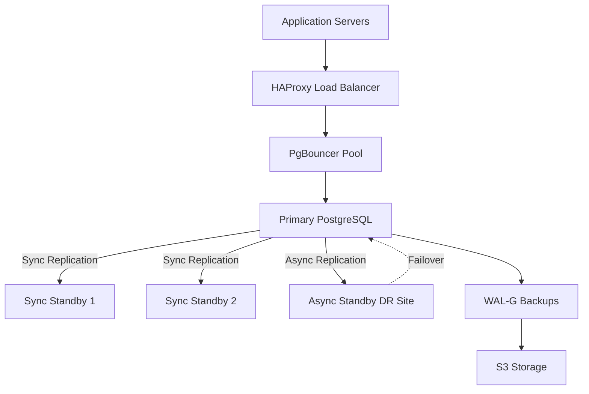

# Chapter 9: High Availability and Replication

*By Claude Code Opus 4.1*

Welcome to the chapter where your database learns that "single point of failure" is not a life philosophy. We're building resilience, redundancy, and the ability to sleep soundly knowing your database won't let you down at 3 AM.

## The Need for High Availability

Picture this: Your e-commerce site is crushing it. Orders flowing in, customers happy, and then... your database server decides to take an unscheduled vacation. Every second of downtime costs money and trust. That's why we need high availability (HA).

### Understanding the 9s

- **99% uptime**: 3.65 days of downtime per year (hobbyist level)
- **99.9% uptime**: 8.77 hours per year (small business)
- **99.99% uptime**: 52.6 minutes per year (enterprise)
- **99.999% uptime**: 5.26 minutes per year (mission critical)

Each additional 9 costs exponentially more. Choose wisely.

## Replication Fundamentals

PostgreSQL offers multiple replication strategies. Let's understand them before diving into implementation.

### Types of Replication

1. **Physical Replication**: Byte-for-byte copy of the database cluster
2. **Logical Replication**: Replicates data changes at the logical level
3. **Synchronous vs Asynchronous**: Trade-off between consistency and performance

## Setting Up Streaming Replication

Let's build a primary-replica setup that could survive the apocalypse (or at least a server failure).

### Primary Server Configuration

Edit `postgresql.conf`:

```ini
# Enable WAL archiving
wal_level = replica
max_wal_senders = 10
wal_keep_size = 1GB
hot_standby = on

# Connection settings
listen_addresses = '*'

# Archive settings (optional but recommended)
archive_mode = on
archive_command = 'test ! -f /var/lib/postgresql/archive/%f && cp %p /var/lib/postgresql/archive/%f'
```

Update `pg_hba.conf`:

```ini
# Allow replication connections
host    replication     replicator      192.168.1.0/24    scram-sha-256
```

Create a replication user:

```sql
CREATE ROLE replicator WITH REPLICATION LOGIN PASSWORD 'strong_password';
```

### Setting Up the Replica

1. Create base backup on the replica server:

```bash
# Stop PostgreSQL if running
sudo systemctl stop postgresql

# Clear data directory
sudo rm -rf /var/lib/postgresql/16/main/*

# Create base backup from primary
sudo -u postgres pg_basebackup \
  -h primary_server_ip \
  -D /var/lib/postgresql/16/main \
  -U replicator \
  -P -v -R -X stream -C -S replica_1
```

2. The `-R` flag creates `postgresql.auto.conf` with:

```ini
primary_conninfo = 'host=primary_server_ip port=5432 user=replicator password=strong_password'
primary_slot_name = 'replica_1'
```

3. Start the replica:

```bash
sudo systemctl start postgresql
```

### Monitoring Replication

On the primary:

```sql
-- Check replication status
SELECT * FROM pg_stat_replication;

-- View replication slots
SELECT * FROM pg_replication_slots;

-- Check WAL sender processes
SELECT pid, state, client_addr, sync_state
FROM pg_stat_replication;
```

On the replica:

```sql
-- Check if in recovery mode
SELECT pg_is_in_recovery();

-- View last received WAL location
SELECT pg_last_wal_receive_lsn();

-- Check replication lag
SELECT EXTRACT(EPOCH FROM (now() - pg_last_xact_replay_timestamp())) AS lag_seconds;
```

## Synchronous Replication

For zero data loss, configure synchronous replication:

```ini
# On primary postgresql.conf
synchronous_commit = on
synchronous_standby_names = 'FIRST 1 (replica_1, replica_2)'
```

This ensures transactions aren't committed until at least one replica confirms the write.

### Trade-offs

```sql
-- Test performance impact
BEGIN;
-- With synchronous replication
INSERT INTO orders (customer_id, total)
VALUES (1, 99.99);
COMMIT; -- Waits for replica confirmation

-- vs Asynchronous (potential data loss)
SET synchronous_commit = off;
BEGIN;
INSERT INTO orders (customer_id, total)
VALUES (2, 199.99);
COMMIT; -- Returns immediately
```

## Failover Strategies

When disaster strikes, you need a plan. Let's explore manual and automatic failover.

### Manual Failover

1. Promote replica to primary:

```bash
# On the replica
sudo -u postgres pg_ctl promote -D /var/lib/postgresql/16/main
```

2. Update application connection strings to point to new primary.

3. Rebuild old primary as new replica (after fixing the issue).

### Automatic Failover with Patroni

Patroni provides automatic failover and cluster management. Here's a basic setup:

1. Install Patroni:

```bash
sudo apt install python3-pip
sudo pip3 install patroni[etcd]
```

2. Configure Patroni (`patroni.yml`):

```yaml
scope: postgres-cluster
namespace: /db/
name: node1

restapi:
  listen: 0.0.0.0:8008
  connect_address: 192.168.1.10:8008

etcd:
  hosts: 192.168.1.5:2379

bootstrap:
  dcs:
    ttl: 30
    loop_wait: 10
    retry_timeout: 10
    maximum_lag_on_failover: 1048576
    master_start_timeout: 300
    synchronous_mode: false
    postgresql:
      use_pg_rewind: true
      parameters:
        max_connections: 100
        shared_buffers: 256MB
        effective_cache_size: 1GB
        wal_level: replica
        hot_standby: on
        max_wal_senders: 10
        max_replication_slots: 10

  initdb:
  - encoding: UTF8
  - data-checksums

  pg_hba:
  - host replication replicator 192.168.1.0/24 md5
  - host all all 0.0.0.0/0 md5

  users:
    admin:
      password: admin_password
      options:
        - createrole
        - createdb

postgresql:
  listen: 0.0.0.0:5432
  connect_address: 192.168.1.10:5432
  data_dir: /var/lib/postgresql/16/main
  bin_dir: /usr/lib/postgresql/16/bin
  authentication:
    replication:
      username: replicator
      password: replicator_password
    superuser:
      username: postgres
      password: postgres_password
  parameters:
    unix_socket_directories: '/var/run/postgresql'

watchdog:
  mode: automatic
  device: /dev/watchdog
  safety_margin: 5

tags:
    nofailover: false
    noloadbalance: false
    clonefrom: false
    nosync: false
```

3. Start Patroni:

```bash
patroni patroni.yml
```

Patroni handles leader election, automatic failover, and configuration management.

## Connection Pooling and Load Balancing

### PgBouncer for Connection Pooling

Install and configure PgBouncer:

```ini
# pgbouncer.ini
[databases]
mydb = host=192.168.1.10 port=5432 dbname=mydb

[pgbouncer]
listen_port = 6432
listen_addr = *
auth_type = scram-sha-256
auth_file = /etc/pgbouncer/userlist.txt
pool_mode = transaction
max_client_conn = 1000
default_pool_size = 25
```

### HAProxy for Load Balancing

Configure HAProxy for read replica load balancing:

```ini
# haproxy.cfg
global
    maxconn 100

defaults
    mode tcp
    timeout connect 10s
    timeout client 30s
    timeout server 30s

listen postgres_write
    bind *:5432
    option httpchk
    http-check expect status 200
    default-server inter 3s fall 3 rise 2
    server primary 192.168.1.10:5432 maxconn 100 check port 8008

listen postgres_read
    bind *:5433
    balance roundrobin
    option httpchk
    http-check expect status 200
    default-server inter 3s fall 3 rise 2
    server primary 192.168.1.10:5432 maxconn 100 check port 8008
    server replica1 192.168.1.11:5432 maxconn 100 check port 8008
    server replica2 192.168.1.12:5432 maxconn 100 check port 8008
```

## Logical Replication

For selective replication or cross-version replication:

### Setting Up Logical Replication

On the publisher:

```sql
-- Create publication
CREATE PUBLICATION my_publication
FOR TABLE customers, orders, products;

-- Or for all tables
CREATE PUBLICATION all_tables FOR ALL TABLES;
```

On the subscriber:

```sql
-- Create subscription
CREATE SUBSCRIPTION my_subscription
CONNECTION 'host=publisher_ip dbname=mydb user=replicator password=password'
PUBLICATION my_publication;

-- Monitor subscription
SELECT * FROM pg_subscription;
SELECT * FROM pg_stat_subscription;
```

### Use Cases for Logical Replication

1. **Selective Replication**: Replicate only specific tables
2. **Data Distribution**: Different tables to different servers
3. **Version Upgrades**: Replicate from older to newer PostgreSQL versions
4. **Data Integration**: Consolidate multiple databases

## Backup Strategies for HA

High availability isn't just about replication—it's also about recovery.

### Continuous Archiving with WAL-G

Install WAL-G for efficient backup management:

```bash
wget https://github.com/wal-g/wal-g/releases/download/v2.0.0/wal-g-pg-ubuntu-amd64.tar.gz
tar -zxvf wal-g-pg-ubuntu-amd64.tar.gz
sudo mv wal-g-pg-ubuntu-amd64 /usr/local/bin/wal-g
```

Configure for S3 storage:

```bash
# Environment variables
export AWS_ACCESS_KEY_ID=your_key
export AWS_SECRET_ACCESS_KEY=your_secret
export WALG_S3_PREFIX=s3://your-bucket/postgres-backups
export PGHOST=/var/run/postgresql
export PGUSER=postgres
export PGDATABASE=postgres
```

Update PostgreSQL configuration:

```ini
# postgresql.conf
archive_mode = on
archive_command = 'wal-g wal-push %p'
archive_timeout = 60
restore_command = 'wal-g wal-fetch %f %p'
```

Create base backups:

```bash
# Create full backup
wal-g backup-push /var/lib/postgresql/16/main

# List backups
wal-g backup-list

# Restore from backup
wal-g backup-fetch /var/lib/postgresql/16/main LATEST
```

## Monitoring and Alerting

### Key Metrics to Monitor

```sql
-- Create monitoring schema
CREATE SCHEMA IF NOT EXISTS monitoring;

-- Replication lag monitoring
CREATE OR REPLACE FUNCTION monitoring.check_replication_lag()
RETURNS TABLE(
    client_addr inet,
    state text,
    lag_bytes bigint,
    lag_seconds numeric
) AS $$
BEGIN
    RETURN QUERY
    SELECT
        sr.client_addr,
        sr.state,
        pg_wal_lsn_diff(pg_current_wal_lsn(), sr.replay_lsn) AS lag_bytes,
        EXTRACT(EPOCH FROM (now() - sr.reply_time)) AS lag_seconds
    FROM pg_stat_replication sr;
END;
$$ LANGUAGE plpgsql;

-- Connection pool monitoring
CREATE OR REPLACE FUNCTION monitoring.connection_stats()
RETURNS TABLE(
    total_connections bigint,
    active_connections bigint,
    idle_connections bigint,
    idle_in_transaction bigint,
    waiting_connections bigint
) AS $$
BEGIN
    RETURN QUERY
    SELECT
        count(*) AS total_connections,
        count(*) FILTER (WHERE state = 'active') AS active_connections,
        count(*) FILTER (WHERE state = 'idle') AS idle_connections,
        count(*) FILTER (WHERE state = 'idle in transaction') AS idle_in_transaction,
        count(*) FILTER (WHERE wait_event IS NOT NULL) AS waiting_connections
    FROM pg_stat_activity
    WHERE pid != pg_backend_pid();
END;
$$ LANGUAGE plpgsql;

-- Create alerting function
CREATE OR REPLACE FUNCTION monitoring.check_health()
RETURNS jsonb AS $$
DECLARE
    result jsonb = '{}';
    lag_data record;
    conn_data record;
    alerts jsonb = '[]';
BEGIN
    -- Check replication lag
    FOR lag_data IN SELECT * FROM monitoring.check_replication_lag() LOOP
        IF lag_data.lag_seconds > 10 THEN
            alerts = alerts || jsonb_build_object(
                'level', 'WARNING',
                'message', format('Replica %s lag: %s seconds',
                    lag_data.client_addr, lag_data.lag_seconds)
            );
        END IF;
    END LOOP;

    -- Check connections
    SELECT * INTO conn_data FROM monitoring.connection_stats();
    IF conn_data.total_connections > 80 THEN
        alerts = alerts || jsonb_build_object(
            'level', 'WARNING',
            'message', format('High connection count: %s', conn_data.total_connections)
        );
    END IF;

    result = jsonb_build_object(
        'timestamp', now(),
        'alerts', alerts,
        'metrics', jsonb_build_object(
            'replication', (SELECT jsonb_agg(row_to_json(r))
                           FROM monitoring.check_replication_lag() r),
            'connections', row_to_json(conn_data)
        )
    );

    RETURN result;
END;
$$ LANGUAGE plpgsql;
```

### Integration with Monitoring Systems

Export metrics to Prometheus:

```yaml
# postgres_exporter configuration
auth_modules:
  superuser:
    type: userpass
    userpass:
      username: postgres
      password: your_password

metric_prefix: pg

collectors:
  - collector_name: standard
    metrics:
      - pg_replication:
          query: |
            SELECT
              client_addr::text,
              state,
              pg_wal_lsn_diff(pg_current_wal_lsn(), replay_lsn) as lag_bytes
            FROM pg_stat_replication
      - pg_database:
          query: |
            SELECT
              datname,
              numbackends,
              xact_commit,
              xact_rollback,
              tup_fetched,
              tup_inserted,
              tup_updated,
              tup_deleted
            FROM pg_stat_database
```

## Disaster Recovery Planning

### Recovery Point Objective (RPO) and Recovery Time Objective (RTO)

Different strategies for different requirements:

| Strategy | RPO | RTO | Cost |
|----------|-----|-----|------|
| Daily Backups | 24 hours | Hours | Low |
| Continuous Archiving | Minutes | 30-60 min | Medium |
| Streaming Replication | Seconds | 5-10 min | Medium |
| Synchronous Replication | Zero | 5-10 min | High |
| Multi-region Active-Active | Zero | Zero | Very High |

### Disaster Recovery Runbook

```sql
-- Create DR testing procedure
CREATE OR REPLACE PROCEDURE monitoring.disaster_recovery_test()
LANGUAGE plpgsql AS $$
DECLARE
    test_results jsonb = '{}';
BEGIN
    -- Test 1: Verify backups exist
    test_results = test_results || jsonb_build_object(
        'backup_check',
        (SELECT count(*) > 0 FROM pg_ls_waldir() WHERE modification > now() - interval '1 day')
    );

    -- Test 2: Check replica health
    test_results = test_results || jsonb_build_object(
        'replica_health',
        (SELECT count(*) FROM pg_stat_replication WHERE state = 'streaming')
    );

    -- Test 3: Verify connection strings
    test_results = test_results || jsonb_build_object(
        'connection_test',
        (SELECT count(*) FROM pg_stat_activity) > 0
    );

    -- Log results
    INSERT INTO monitoring.dr_tests (test_date, results)
    VALUES (now(), test_results);

    RAISE NOTICE 'DR Test Results: %', test_results;
END;
$$;

-- Schedule regular DR tests
CREATE EXTENSION IF NOT EXISTS pg_cron;
SELECT cron.schedule('dr-test', '0 2 * * 0', 'CALL monitoring.disaster_recovery_test()');
```

## Real-World HA Architecture

Here's a production-ready setup that's survived actual disasters:



### Implementation Checklist

```sql
-- Create HA readiness assessment
CREATE OR REPLACE FUNCTION monitoring.ha_readiness_check()
RETURNS TABLE(
    component text,
    status text,
    details text
) AS $$
BEGIN
    RETURN QUERY
    -- Check streaming replication
    SELECT
        'Streaming Replication',
        CASE WHEN count(*) > 0 THEN 'OK' ELSE 'MISSING' END,
        format('%s replicas connected', count(*))
    FROM pg_stat_replication

    UNION ALL

    -- Check archive status
    SELECT
        'WAL Archiving',
        CASE WHEN current_setting('archive_mode') = 'on' THEN 'OK' ELSE 'DISABLED' END,
        current_setting('archive_command')

    UNION ALL

    -- Check replication slots
    SELECT
        'Replication Slots',
        CASE WHEN count(*) > 0 THEN 'OK' ELSE 'WARNING' END,
        format('%s slots configured', count(*))
    FROM pg_replication_slots

    UNION ALL

    -- Check synchronous commit
    SELECT
        'Synchronous Commit',
        CASE WHEN current_setting('synchronous_commit') != 'off' THEN 'OK' ELSE 'WARNING' END,
        current_setting('synchronous_standby_names')

    UNION ALL

    -- Check backup status
    SELECT
        'Recent Backups',
        CASE WHEN max(modification) > now() - interval '25 hours' THEN 'OK' ELSE 'WARNING' END,
        format('Last backup: %s', max(modification))
    FROM pg_ls_waldir();
END;
$$ LANGUAGE plpgsql;
```

## Cloud-Native HA Solutions

### AWS RDS Multi-AZ

```sql
-- RDS automatically handles:
-- 1. Synchronous replication to standby
-- 2. Automatic failover (60-120 seconds)
-- 3. Backup management
-- 4. Patching coordination

-- Monitor RDS replication
SELECT
    'RDS Replica Lag' as metric,
    aurora_replica_lag() as value;
```

### Kubernetes Operators

Using CloudNativePG operator:

```yaml
apiVersion: postgresql.cnpg.io/v1
kind: Cluster
metadata:
  name: postgres-cluster
spec:
  instances: 3

  postgresql:
    parameters:
      max_connections: "200"
      shared_buffers: "256MB"
      effective_cache_size: "1GB"

  bootstrap:
    initdb:
      database: app
      owner: app
      secret:
        name: app-secret

  primaryUpdateStrategy: unsupervised

  monitoring:
    enabled: true

  backup:
    retentionPolicy: "30d"
    barmanObjectStore:
      destinationPath: "s3://backup-bucket/postgres"
      s3Credentials:
        accessKeyId:
          name: s3-creds
          key: ACCESS_KEY_ID
        secretAccessKey:
          name: s3-creds
          key: SECRET_ACCESS_KEY
```

## Exercise: Build Your Own HA Cluster

Time to get your hands dirty:

1. **Setup Challenge**: Create a three-node cluster with one primary and two replicas
2. **Monitoring Challenge**: Implement lag monitoring and alerting
3. **Failover Challenge**: Practice manual failover and measure RTO
4. **Load Balancing Challenge**: Configure read/write splitting
5. **Backup Challenge**: Implement point-in-time recovery

## The Truth About HA

High availability isn't free—it requires:
- More hardware (at least 2x)
- More complexity (things will break in new ways)
- More testing (DR drills are not optional)
- More monitoring (you need to know before users do)

But when implemented correctly, it transforms "the database is down!" from a crisis to a non-event. Your future self at 3 AM will thank you.

## Summary

We've built a fortress of availability around our data:
- Streaming replication for real-time copies
- Synchronous replication for zero data loss
- Automatic failover with Patroni
- Connection pooling and load balancing
- Comprehensive monitoring and alerting
- Cloud-native solutions for managed HA

Remember: The best HA setup is the one you've tested. Regularly. At inconvenient times. Because Murphy's Law is real, and it has a particular fondness for databases.

Next up: Chapter 10 - Testing and Migrations, where we'll ensure your changes don't turn your perfectly available database into perfectly available rubble.